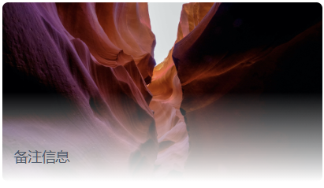

**`<gradient>`** [CSS](https://developer.mozilla.org/zh-CN/docs/Web/CSS) [数据类型](https://developer.mozilla.org/zh-CN/docs/Web/CSS/CSS_Values_and_Units/CSS_data_types) 是 [``](https://developer.mozilla.org/zh-CN/docs/Web/CSS/image) 的一种特殊类型，包含两种或多种颜色的过渡转变。常用的有两种

- linear-gradient
- radial-gradient


### linear-gradient

 线性渐变，且可指定开始/结束渐变位置，可使用的场景有

- 纯色背景渐变
- 图片背景渐变



```css
.css {
	background: linear-gradient(to bottom, transparent 50%, rgba(255,255,255,1)), url(...);
	backgrouns-size: 100%;
}

```


### 文档

[CSS：层叠样式表 | MDN | https://developer.mozilla.org/zh-CN/docs/Web/CSS/gradient](https://developer.mozilla.org/zh-CN/docs/Web/CSS/gradient)

